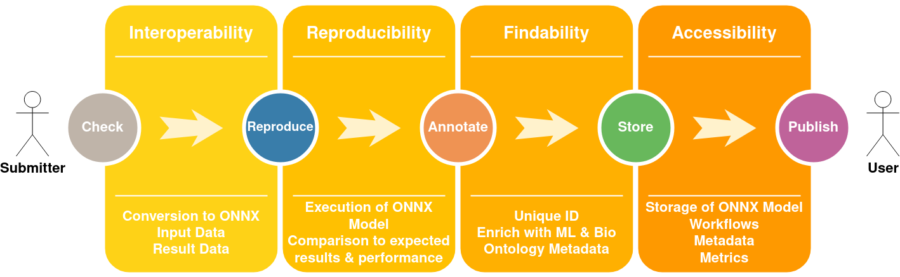

# Introduction

Machine learning (ML) models are widely used as tools in life science and medical research. However, ML models are scattered across various resources including personal websites, git-hub, bitbucket, and supplementary material, making it difficult to find, access, and reuse them. We propose to extend BioModels (https://www.ebi.ac.uk/biomodels) to support FAIR dissemination of ML models in biomedical sciences. BioModels is an ELIXIR deposition database of biomedical mechanistic models, hosted at EMBL-EBI and accessed by about 51,000 unique users (IPs) annually. BioModels’s infrastructure was recently enhanced to support version-controlled dissemination and curation of a wide range of modelling frameworks and formats, providing capabilities to host and disseminate ML models. We propose to engage with the ML modellers during BioHackathon to support the dissemination of their models to BioModels. We will semantically enrich models with controlled vocabularies such as Disease and Gene Ontologies adapting the existing metadata-support and curation guidelines in BioModels. ML models can be linked with the model data hosted within EMBL-EBI and other ELIXIR nodes through cross-references using BioModels qualifiers. Using the metadata, the sophisticated search engine of BioModels will allow users to easily find and download ML models. We will use this BioHackathon to perform a pilot work on FAIR model dissemination via BioModels. Firstly, we will engage with ML modellers and identify minimal and essential metadata standards for ML models, and adapt the existing interoperable COMBINE metadata framework to implement it. We will semantically enrich the existing 16 ML models in BioModels (https://www.ebi.ac.uk/biomodels/search?query=submitter_keywords%3AMachine+Learning+Model&domain=biomodels_all). Following on, we will solicit ML model submissions from the ELIXIR ML modelling community. We will also import and annotate publicly available key ML models to extend the collection in BioModels. Through this pilot work, we will demonstrate the proof of the concept to disseminate metadata-rich, data and tools cross-referenced FAIR ML models via BioModels.

# Expected Outcomes

Establish minimal metadata standard (Version 1) to enhance findability of ML model, based on Bioschema and/or BioModels Qualifiers. The minimal metadata will cover broader aspects including the biology of the model, ML method, data and tools used, features, inputs, and output of the model. Identification of key ontologies and extension of COMBINE standard and BioModels SOP to annotate ML models Annotation of existing ML models established metadata standards in BioModels. External submission of ML models from the ELIXIR community to BioModels Publicly available pilot collection of FAIR ML models in BioModels

## Subsection level 2

Please keep sections to a maximum of only two levels.

## Tables and figures

Tables can be added in the following way, though alternatives are possible:

| Header 1 | Header 2 |
| -------- | -------- |
| item 1 | item 2 |
| item 3 | item 4 |

Table: Note that table caption is automatically numbered.

A figure is added with:

# Other main section on your manuscript level 1

Lists can be added with:

1. Item 1
2. Item 2

# Citation Typing Ontology annotation

You can use CiTO annotations, as explained in [this BioHackathon Europe 2021 write up](https://raw.githubusercontent.com/biohackrxiv/bhxiv-metadata/main/doc/elixir_biohackathon2021/paper.md) and [this CiTO Pilot](https://www.biomedcentral.com/collections/cito).
Using this template, you can cite an article and indicate why you cite that article, for instance DisGeNET-RDF [@citesAsAuthority:Queralt2016].

Possible CiTO typing annotation include:

* citesAsDataSource: when you point the reader to a source of data which may explain a claim
* usesDataFrom: when you reuse somehow (and elaborate on) the data in the cited entity
* usesMethodIn
* citesAsAuthority
* discusses
* extends
* agreesWith
* disagreesWith

# Results

Curation of one of three ML models (reproducibility & reusability) 👈
ONNX conversion works 😎
Re-execution of one model with equal results ✅
Other models for AI-based automated metadata extraction for biological entities & blood cell classification 

We succeeded to curate one previously published machine learning model, namely a ....

|      	      | NM P0 | ONNX P0 | NM P1 | ONNX P1 |
|-----------	|-------|---------|-------|---------|
| Precision 	| 0.95  | 0.95    | 0.9   | 0.9  	  |
| Recall    	| 0.90  | 0.90    | 0.95  | 0.95 	  |
| F1-Score  	| 0.93  | 0.93    | 0.93  | 0.93 	  |
| Support   	| 519   | 519     | 481   | 481  	  |

Table 1. Comparison of native and converted ONNX model on two distinct datasets (P0, P1)....

# Discussion

Finalize curation of remaining two ML models
Finalize BioHackrXiv report for FAIR ML models in BioModels 
Integration of further ML models with biological application => submission workflow for BioModels

## Acknowledgements

Four main on-site participants
Sheriff
Sucheta
Sumukh
Nils
Collaboration with ~10 contributors from other groups: 5, 17, 23, … 
Great discussion on bioschemas & 🥳 
(Bioimaging) EDAM!

## References

- BioModels
- BioSchema
- ONNX
- 
